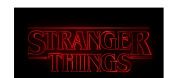

<p align="center">
  

  

   

  <a href="https://www.linkedin.com/in/felipeoes" target="_blank">
    
  </a>

</p>
<h1 align="center">
    
</h1>

<p align="center">
  <a href="#-about">💻 About</a>&nbsp;&nbsp;&nbsp;|&nbsp;&nbsp;&nbsp;
  <a href="#-%EF%B8%8F-functionalities">⚙️ Functionalities</a>&nbsp;&nbsp;&nbsp;|&nbsp;&nbsp;&nbsp;
  <a href="#-technologies">🛠 Technologies</a>&nbsp;&nbsp;&nbsp;|&nbsp;&nbsp;&nbsp;
  <a href="#video_game-usage">:video_game: Usage</a>&nbsp;&nbsp;&nbsp;|&nbsp;&nbsp;&nbsp;
  <a href="#memo-license">📝 License</a>&nbsp;&nbsp;&nbsp;|&nbsp;&nbsp;&nbsp;
  <a href="#-author">👦 Author</a>
</p>

<p align="center">
  
</p>

See [](https://strangerquiz.felipeoes.vercel.app/)


## 💻 About

Stranger Things Quiz is a leisure app that brings out a quiz game about the series Stranger Things, besides possibilitating user to play a lot of others quiz games :video_game:

Developed during the event React Immersion edition NextJS, promoted by Alura!

---

## [](https://github.com/felipeoes/codequiz#-%EF%B8%8F-functionalities) ⚙️ Functionalities

Before playing, user must input its username in order to active "play button" and "other quizes button"

By pressing the play button, a quiz containing a question with some alternatives show up and game begins. If the question is either correct or wrong, the app will notify user and move on to the next question.

At the end of the game, a result screen appears and user has the option to return to main page or visualize a fake ranking with pontuation that is exhibited using a modal.

---

## 🛠 Technologies

This project was developed using the following technologies:

- Javascript
- ReactJs
- NodeJs
- NextJs

---

## :video_game: Usage

### Prerequisites

Before starting to run the application, you will need to install [Node.js](https://nodejs.org/en/) and [Git](https://git-scm.com) on your machine.

#### 🧭 Running application

```bash

# Clon this repo
$ git clone https://github.com/felipeoes/codequiz.git

# Access project directory and run on terminal
$ cd codequiz

# Install all dependencies
$ npm install
# or
$ yarn

# Run app on dev mode
$ npm run dev
# or
$ yarn run dev

# Application will be opened at port:3000, so just access http://localhost:5500

```
---

## :memo: License

This project is under MIT license. Check out [LICENSE](LICENSE.md) for more details.

---

## 👦 Author
  <p><b>Felipe Oliveira</b></p>
 
 <br />
 

Made with :heart: by Felipe Oliveira
 
[](https://www.linkedin.com/in/felipeoes)
[](https://api.whatsapp.com/send?phone=5511987106320&text=Oi,Felipe)
[](mailto:felipeoes@usp.br)
